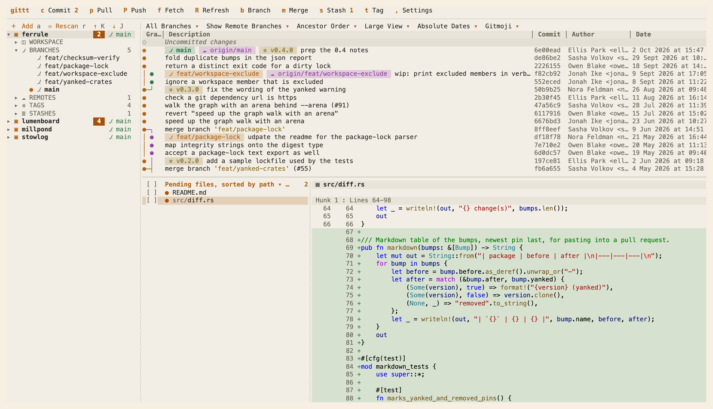
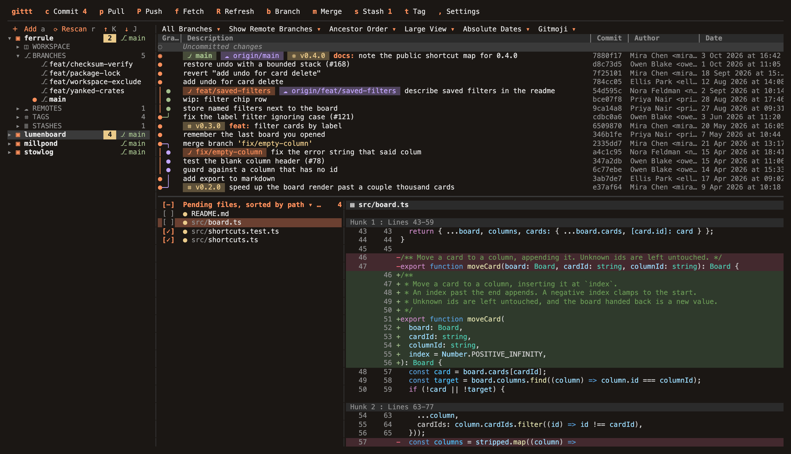

# gittt

<!-- cover: docs/light.png -->
<!-- date: 2026-10-06T03:00:00Z -->

**A git browser for the terminal.** Every repository under a folder in one sidebar, a commit graph, changed files and highlighted diffs, a dialog for every action, and full mouse support.

[](https://github.com/illinifellow/gittt-cli/actions/workflows/ci.yml)
[](LICENSE)
[](https://nodejs.org)
[](https://buymeacoffee.com/illinifellow)



It started with a screen split in two: code on one side, the terminal on the other. Every look at history or a diff meant leaving it for a desktop git client. The goal was a git client inside that terminal, so a whole session fits on one display.

Terminal clients live in the right place but read like a reference card: a key for everything, no mouse, one repository at a time. Desktop clients get the layout right: repositories on the left, graph in the middle, files and diff below, a toolbar, a dialog per action. gittt puts that layout into a half-screen terminal. Redrawing panes as text was too slow on big histories; what worked was panes as regions with their own scroll, focus and hit-testing, a graph laid out once per history, and highlighting in small batches between keystrokes.



## How it's built

TypeScript on Node 22, calling `git` directly, drawing with true colour and SGR mouse reporting. A file watcher refreshes within a second through a small shared read pool; actions on a repository queue, and background fetches yield to them.

## Features

- **Many repositories:** everything under a folder, in your order; add any by path, remove from the list without touching disk.
- **Commit graph:** coloured lanes, rounded merges, tinted branch, remote and tag labels.
- **Live:** changes, worktrees and submodules included, appear within a second; remotes are fetched every few minutes. `R` rereads everything and fetches all remotes.
- **Visible states:** uncommitted changes, a stopped rebase, merge, cherry-pick, revert or bisect, conflicts, detached HEAD.
- **Files and diffs:** by path, status or tree, with line numbers, highlighted in your VS Code theme.
- **Self-contained:** stage with checkboxes, commit and push from a dialog, view any file; nothing opens another program.
- **Dialogs** for every action, **mouse** everywhere, highlighting that never blocks input.

## Requirements

- Node.js 22.15+ and `git` 2.31+ on `PATH`.
- A terminal with true colour and SGR mouse reporting; tested in iTerm2 and the VS Code terminal on macOS.

## Install

```sh
npm install --global https://github.com/illinifellow/gittt-cli/releases/latest/download/gittt-cli.tgz
```

**Update** appears in the toolbar when a newer release exists; a click installs it and restarts in place. From a clone:

```sh
git clone https://github.com/illinifellow/gittt-cli.git
cd gittt-cli
npm install
npm link
```

## Run

```sh
gittt            # asks which folder to search, prefilled with the current one
gittt ~/code     # prefills that folder instead
```

Tab completes, arrows or mouse pick a recent folder, Enter starts. The search goes three levels deep, skipping `node_modules`, build output and caches.

## The screen

The toolbar holds Commit, Pull, Push, Fetch, Refresh, Branch, Merge, Stash, Tag and Settings with counts, and short messages at its right end. The sidebar lists repositories with change count, ahead/behind and branch; each opens into WORKSPACE (status, history, search), BRANCHES, REMOTES, TAGS and STASHES. The filter bar toggles all or current branch, remote branches, ancestor or date order, compact view, relative dates and gitmoji. The log shows graph, description, commit, author and date; the working tree is its own row, with any stopped operation and conflicts. Files list by path, status (conflicts first) or tree; a checkbox stages a pending file, except one still holding conflict markers. The diff shows hunks, or a whole file on double-click or Enter, tabs expanded to `limits.tabWidth`.

A terminal too small says so instead of drawing broken panes. Compact View uses one cell per lane and hides emails. Highlighting reads VS Code's theme and `editor.tokenColorCustomizations`, falling back to Dark+.

## Dialogs

| Action                      | Options                                                       |
| --------------------------- | ------------------------------------------------------------- |
| Commit                      | message, amend, push (off by default); commits staged files   |
| Fetch                       | all remotes, prune, tags                                      |
| Pull                        | remote and branch, commit merged, messages, no-ff, rebase     |
| Push                        | remote, branches and upstreams, track new, all tags, force    |
| New Branch                  | name, from parent or a commit, checkout                       |
| Delete Branches             | local and remote, force                                       |
| Merge                       | branch or commit, commit merged, messages, no-ff, rebase      |
| Stash                       | message, keep staged, include untracked                       |
| Add Tag                     | name, commit, push, lightweight, message, move existing       |
| Checkout                    | branch or detached HEAD; remote branch as new tracking branch |
| Rename / Delete Branch      | new name; force, delete upstream                              |
| Remove / Push Tag           | from all remotes; to one remote                               |
| Reset                       | soft, mixed, hard                                             |
| Rebase, Cherry-pick, Revert | confirmation; commit immediately, add "cherry picked from"    |
| Apply / Pop / Delete Stash  | delete after applying, restore staged state                   |

Local checkout needs no dialog; git errors show in the toolbar. With "commit merged" off, merge and pull never fast-forward. Force push uses `--force-with-lease --force-if-includes`, so remote commits you never saw block it even after a background fetch. Names are validated by git's rules first. Network actions never prompt: ssh runs in batch mode (use an agent or credential helper), and a silent remote is stopped after `limits.fetchTimeoutSeconds`.

## Keyboard

| Key                             | Action                                                              |
| ------------------------------- | ------------------------------------------------------------------- |
| `Tab` `Shift+Tab`               | next / previous pane                                                |
| `↑` `↓` `PgUp` `PgDn`           | move                                                                |
| `Home` `End`                    | first / last commit                                                 |
| `←` `→`                         | sidebar: collapse or parent / expand or child; else scroll sideways |
| `Shift+←` `Shift+→`             | scroll the sidebar sideways                                         |
| `Enter`                         | open, check out, view file                                          |
| `Space`                         | fold, stage / unstage, or context menu                              |
| `.`                             | context menu                                                        |
| `,`                             | Settings                                                            |
| `/`                             | filter sidebar or search log                                        |
| `y`                             | copy full hash                                                      |
| `c` `f` `p` `P` `b` `m` `s` `t` | Commit, Fetch, Pull, Push, Branch, Merge, Stash, Tag                |
| `R`                             | Refresh all, fetch all remotes                                      |
| `Esc`                           | close viewer, dialog or menu                                        |
| `a` `x`                         | add repository by path; remove from list                            |
| `K` `J`                         | move repository up / down                                           |
| `r`                             | rescan: new appear, removed return                                  |
| `1` – `6`                       | branches, remotes, order, view, dates, gitmoji                      |
| `v`                             | file list: path, status, tree                                       |
| `[` `]` `{` `}` `(` `)` `<` `>` | narrow / widen graph, author, date, sidebar columns                 |
| `q` `Ctrl+C`                    | quit; during an action `q` waits, a second `q` quits at once        |

## Mouse

| Gesture                 | Action                                                        |
| ----------------------- | ------------------------------------------------------------- |
| click                   | select, press, toggle                                         |
| double-click            | check out; open file in viewer (at the diff line)             |
| right-click             | context menu                                                  |
| wheel                   | scroll pane under pointer; in a dialog, move between controls |
| `Shift`+wheel, trackpad | scroll sideways                                               |
| drag a divider          | resize panes and columns                                      |
| drag a repository row   | reorder                                                       |
| drag in the diff        | select text, copied on release (over ssh via the terminal)    |
| click a checkbox        | stage / unstage; header checkbox does all                     |
| click a hash            | copy full hash                                                |
| `⌥` drag (iTerm2)       | the terminal's own selection                                  |

## Configuration

**Settings** (`,` or toolbar) covers theme, icons, views, filters, commit count, search depth and skips, fetch interval, diff limit, double-click time and recent-folder count. Changes apply at once; depth or skip changes rescan.

Configuration is `settings.json` in two files of one shape:

| File                                    | Holds                                                         |
| --------------------------------------- | ------------------------------------------------------------- |
| `config/settings.json` (in the package) | every default: settings, limits, columns, keys, themes, icons |
| `~/.config/gittt-cli/settings.json`     | your changes, plus `state` (recent folders, repository lists) |

They merge on start; the app writes only changed values, atomically. Hand edits may use comments and trailing commas; a removed value reverts to default. Invalid values fall back to defaults, an unparsable file is never overwritten, and the toolbar reports where. `$XDG_CONFIG_HOME` moves the user file.

| Section    | What it holds                                                                                                                                                                                                              |
| ---------- | -------------------------------------------------------------------------------------------------------------------------------------------------------------------------------------------------------------------------- |
| `settings` | `theme`, `icons`, filters, view, dates, gitmoji, file view, `maxCommits`, `scanDepth`, `scanExclude`, `fetchMinutes` (default 5, 0 = off)                                                                                  |
| `limits`   | diff cap, tab width, highlighting batch, cache sizes, timings (cursor settle, refresh, watcher polling, double-click, messages, update check), concurrency, fetch timeout and backoff, recent folders, ignored watch paths |
| `columns`  | pane and column widths, lower pane height (`null` = automatic)                                                                                                                                                             |
| `keys`     | the key for every action                                                                                                                                                                                                   |
| `themes`   | `colors`, `glyphs`, `spacing`, `syntax` per theme; your own may `extends` another                                                                                                                                          |
| `iconSets` | icon replacements, e.g. `nerd` for Nerd Fonts; `settings.icons` picks one, `unicode` keeps the theme's                                                                                                                     |
| `tokens`   | single `colors`, `glyphs` or `spacing` values over the active theme                                                                                                                                                        |

### Themes

**golden-brown** is dark, warm orange on brown, drawn on the terminal's background (`transparent`). **milk-and-honey** is light, milky with amber, and paints its own ground. `settings.theme` defaults to `auto`, picking by the terminal's background. `syntax` is `vscode` or a bundled theme such as `light-plus`. A custom theme is another `themes` entry; what it omits, nested glyphs included, comes from its `extends` (golden-brown by default). Icon sets and `tokens` override single values the same way.

- `colors`: grounds, text, borders, accent, selections, refs, HEAD, stash, danger, file states, diff, labels, `lanes` (graph palette).
- `glyphs`: every icon, mark and graph character.
- `spacing`: indents, gaps, widths of dialogs, menus and fields, minimum pane sizes, column limits, resize step.

## Development

```sh
npm install
npm run build       # dist/app.js and the dist/cli.js launcher
npm run typecheck
npm test            # graph, dialogs, settings, input and text layout, the store and the git layer against real repositories, the main screen
```

In a checkout, `gittt` restarts in place when `dist/app.js` changes.

## Contributing

Every change starts as a [bug report](https://github.com/illinifellow/gittt-cli/issues/new?template=bug_report.yml) or a [feature request](https://github.com/illinifellow/gittt-cli/issues/new?template=feature_request.yml), is worked on its own branch, and lands through a pull request that closes the issue; the branch is deleted on merge.

## License

[MIT](LICENSE)
